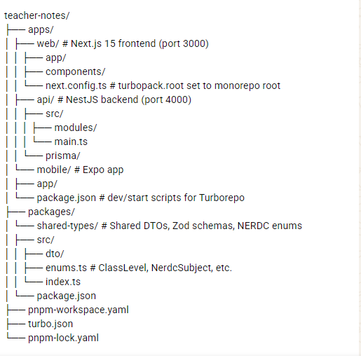

# Teacher Notes — NERDC Lesson Notes Generator

An AI-powered platform for Nigerian teachers to generate, manage, and export NERDC-compliant lesson notes in seconds. Built as a full-stack monorepo with web, mobile, and API.

> **Status:** Portfolio → Production-ready. Active development.

Live: [web-teacher-notes.vercel.app](https://www.github.com/udohlawrence) | API: [api-teacher-notes.onrender.com](https://www.github.com/udohlawrence)

## Core Features

- Generate lesson notes aligned with NERDC curriculum
- Roles: Teacher, HOD, School Admin
- Export to PDF/DOCX
- Curriculum autocomplete (ClassLevel, NERDC Subject, Topics)
- Offline-ready mobile app for teachers in low-connectivity areas

## Tech Stack

| Layer | Tech |
| :--- | :--- |
| **Monorepo** | pnpm Workspaces + Turborepo |
| **Web** | Next.js 15 (App Router) + Turbopack, Tailwind CSS, shadcn/ui |
| **Mobile** | Expo (React Native) + TypeScript |
| **API** | NestJS + Prisma + PostgreSQL |
| **Shared** | `@repo/shared-types` - Single source of truth for DTOs, enums |
| **Auth** | NextAuth / JWT |
| **Deployment** | Vercel (web), Render/Fly (api), EAS (mobile) |

## Folder Structure



**Key Architectural Decision:** No nested `.git` folders. Only one `.git` at root. All packages are linked via `workspace:*`.

## Prerequisites

- Node.js >= 20
- pnpm 9.12.1+ (enforced via `packageManager` field)

  ```bash
  npm i -g pnpm
  ```

## Getting Started

1. **Clone & Install**

  ```bash
  git clone https://github.com/udohlawrence/teacher-notes.git
  cd teacher-notes
  pnpm install
  ```

2. **Environment Variables** Create env files: apps/api/.env

  ```javascript
  DATABASE_URL="postgresql://..."
  JWT_SECRET="super-secret"
  PORT=4000
  ```

apps/web/.env.local

  ```javascript
  DATABASE_URL="postgresql://..."
  JWT_SECRET="super-secret"
  PORT=4000
  ```

  apps/mobile/.env

  ```javascript
  EXPO_PUBLIC_API_URL=http://10.0.2.2:4000 # Android emulator
  ```

3. **Run Dev (All Apps)**

  ```bash
  pnpm dev
  ```

## Scripts

Run from **ROOT**

| Command | Description |
| :-- | :-- |
| _pnpm dev_ | Run all apps in parallel (web + api + mobile) |
| _pnpm build_ | Build all apps & packages |
| _pnpm lint_ | Lint all workspaces |
| _pnpm --filter web dev_ | Run only web |
| _pnpm --filter api dev_ | Run only api |
| _pnpm --filter mobile dev_ | Run only mobile |
| _pnpm --filter @repo/shared-types build_ | Build shared types |
